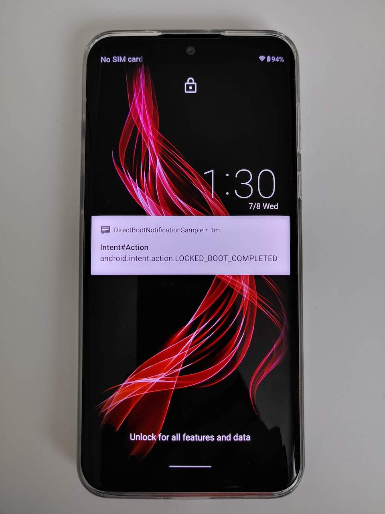

# DirectBootNotificationSample

Simply check how is notification shown on the device running on DirectBoot mode.

## Expected behavior

### 1. Boot into DirectBoot mode
Shows notificaiton.

### 2. Unlock flow
Notification has temporary gone by passcode field.

### 3. Boot completed
Shows notification again.

